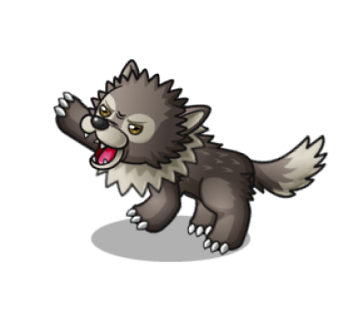
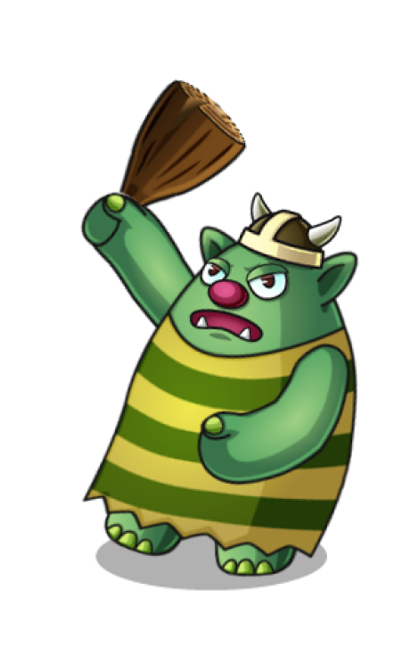
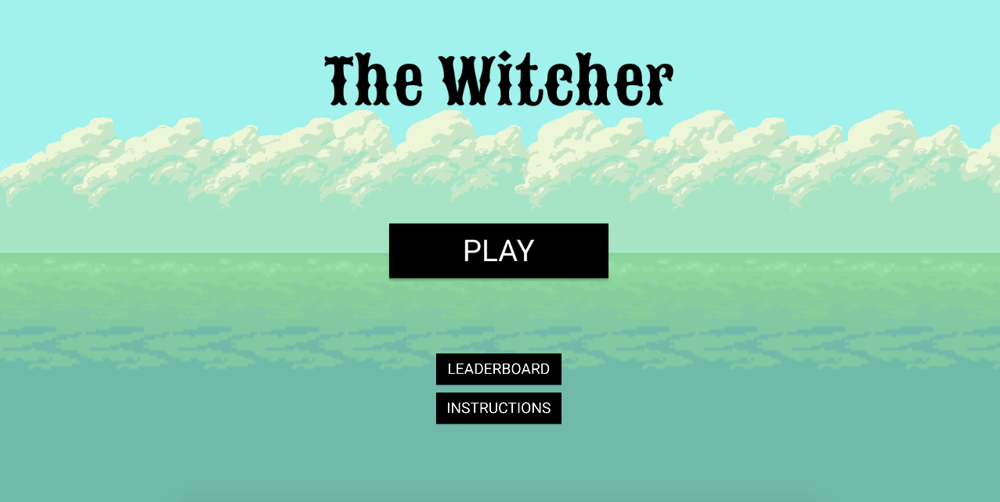
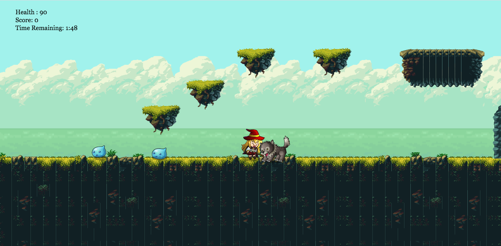
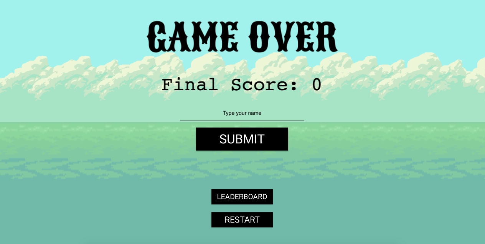
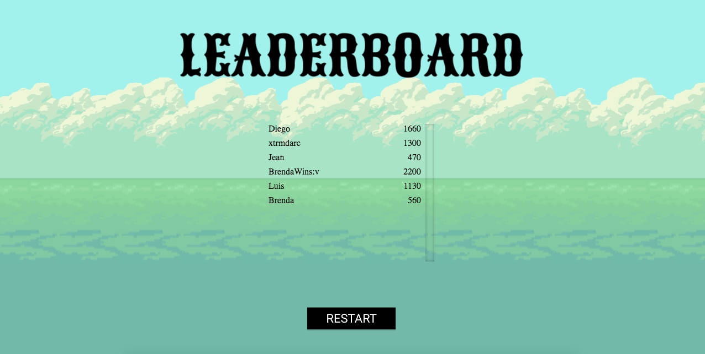

# The Witcher

<h1 align="center"></h1>

This is Microverse's final project in Javascript's course.

In this project, I build a shooter game using JavaScript's framework [Phaser 3](https://phaser.io/), a "fast,free and fun open-source framework for Canvas and WebGL powered browser games".

# Description

This is an original shooter game built from scratch using Phaser 3 and vanilla Javascript OOP best practices. The game is called The Witcher.

# The Game

The Witcher is a slightly different shooter game in which enemies will spawn from the top and the right side of the game canvas. The main caracther 'Pipoya' fights in the 'Magic Cliff' to prevent monsters to enter her world. You control Pipoya's movement with the **arrow keys** while shooting arrows with **space** and **jumping with the up arrow key**. Defeat as many enemies as you can before you run out of health or time!

You get points after killing an enemy. Each enemy will give a different fixed number of points. You'll also recieve extra time after killing an enemy.

At the end, you can enter your name in the leaderboard and check the highest scores.

## How to play

- Use the **right and left arrow keys** to move Pipoya around the map.
- Use the **up arrow key** to jump to evade enemi attacks.
- Use the **space bar** to shoot Pipoya's arrows.

You can play the game online clicking [here](https://agile-mesa-29255.herokuapp.com/) or locally following these steps:

* Click on the green button "Clone or Download"
* Click on Download ZIP
* Extract the game
* In your terminal, navigate to the game's folder
* Run 'node server.js'
* Open, in your browser, 'localhost:8080'
* Beat my record and make my name disappear from the Leader Board

## Design

The game uses high quality sprites to bring all scenes to life. You can expect well designed animations and map textures. I used [this](https://pipoya.itch.io/) sprite pack for animating hero and enemies Game Objects, and [this one](https://ansimuz.itch.io/magic-cliffs-environment) for rendering the map.

### Pipoya

- Role: Main Character  
- Health: 100  
- Damage: 10  
- Weapon: Arrow  

### Droppy

- Role: Enemy  
- Health: 20  
- Damage: 5  
- Weapon: No Weapon  
- Points: 40  

### Wolfy

- Role: Enemy  
- Health: 50  
- Damage: 10  
- Weapon: No Weapons  
- Points: 90  
Tip : Don't fight this guy if you want to remain alive.

### Ogre

- Role: Enemy  
- Health: 200  
- Damage: 30  
- Weapon: Maze  
- Points: 100  

## Scenes

### Main Menu

### Play

### Game Over

### Leaderboard

# Built With

- JavaScript
- A bit of HTML and CSS for the front end
- Phaser 3
- Webpack
- Eslint
- Stylelint
- Babel
- Jest
- Express
- Node
- ES6
- NPM
- Github
- [Heroku](https://www.heroku.com/) for the deployment
- Leaderboard API service

## NPM available scripts
Use "npm run-script " followed by any of the following commands : 

- "build": "webpack --mode production"
- "watch": "webpack --mode development --watch"
- "test": "jest"

# Future Work

- Add MMORPG functionality
- Add Music
- Make a mobile version
- Develop the lore
- Add more complex levels and worlds

## Contact

👤 **Diego Antonio Reyes Coronado**

- Github: [@xtrmdarc](https://github.com/xtrmdarc)
- Twitter: [@diegoreyesco](https://twitter.com/DiegoAn91629127)
- Linkedin: [diegoreyesco](https://www.linkedin.com/in/diego-reyes-coronado)

## 🤝 Contributing

Contributions, issues and feature requests are welcome!

Feel free to check the [issues page](https://github.com/xtrmdarc/the-witcher/issues).

## Show your support

Give a ⭐️ if you like this project!

